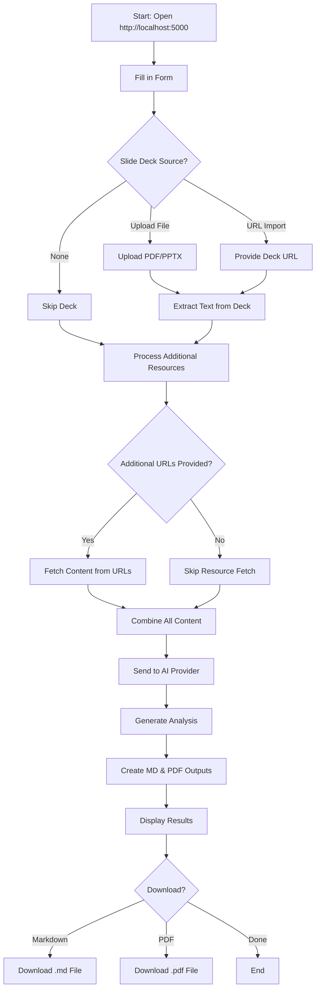
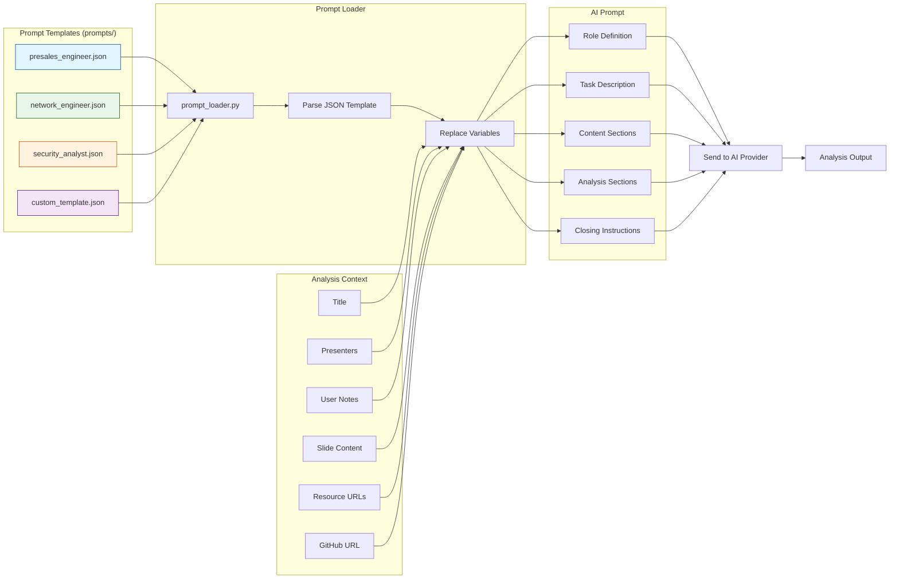
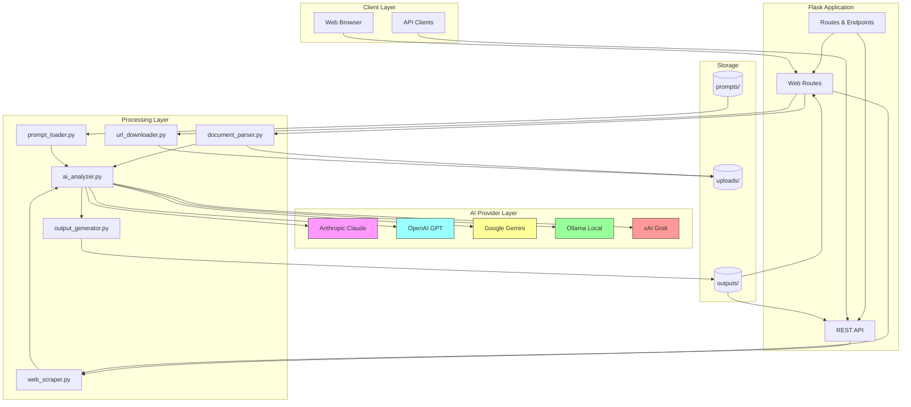
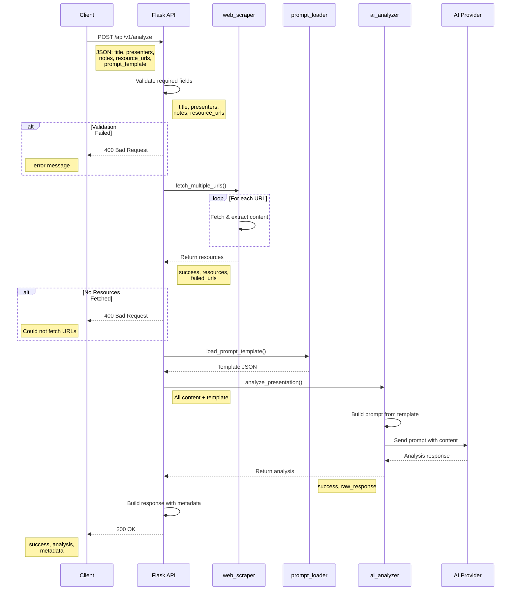

# Presentation Intelligence Tool

Transform technical presentations into actionable insights tailored to your role using AI-powered analysis.

## Overview

The Presentation Intelligence Tool is a Flask-based web application that analyzes conference and vendor presentations using AI. It extracts actionable insights tailored to your specific role—whether you're a pre-sales engineer identifying client opportunities, a network engineer evaluating architecture patterns, or a security analyst assessing threats and controls.

## Features

- **Flexible Input Options**:
  - Upload PDF or PPTX presentation files (up to 50MB)
  - Import presentations from URLs
  - Analyze web-based resources (lab guides, documentation)
  - Or combine all of the above!

- **AI-Powered Analysis** with multiple provider options:
  - Anthropic Claude
  - OpenAI GPT
  - Google Gemini
  - Ollama (local models)
  - xAI Grok

- **Comprehensive Reports** including:
  - Executive summaries
  - Key technical insights
  - Client value connections
  - Pre-sales opportunities
  - Intelligent follow-up questions
  - Resource analysis (GitHub repos, documentation, etc.)

- **Export Options**:
  - Download results as Markdown or PDF
  
## Technology Stack

- **Backend**: Python 3.12+, Flask 3.0+
- **AI Engines**: Support for Anthropic, OpenAI, Google, Ollama, xAI
- **Document Processing**: PyMuPDF, python-pptx, BeautifulSoup4
- **Output Generation**: markdown2, WeasyPrint
- **Package Management**: UV (recommended) or pip

## Quick Start

### Prerequisites

- Python 3.12 or higher
- UV package manager (recommended) or pip
- API key for your chosen AI provider (Anthropic, OpenAI, Google, Ollama, or xAI)

### Installation

1. **Clone the repository**:
```bash
git clone https://github.com/seanerama/Presentation-Intelligence-Tool.git
cd Presentation-Intelligence-Tool
```

2. **Install dependencies**:
```bash
# Using UV (recommended) - install with your chosen AI provider
uv sync --extra openai        # OpenAI GPT
uv sync --extra anthropic     # Anthropic Claude
uv sync --extra google        # Google Gemini
uv sync --extra ollama        # Ollama (local models)
uv sync --extra xai           # xAI Grok
uv sync --extra all-providers # All providers

# Or using pip
pip install -r requirements.txt
pip install openai  # or anthropic, google-generativeai, ollama
```

3. **Configure environment**:
```bash
cp .env.example .env
# Edit .env with your preferred editor
```

Set the following in `.env`:
```env
# REQUIRED: Choose your AI provider
AI_PROVIDER=openai  # or anthropic, google, ollama, xai

# REQUIRED: Add your API key (get from AI Provider Setup section below)
OPENAI_API_KEY=your-key-here

# REQUIRED: Generate with: python -c "import secrets; print(secrets.token_hex(32))"
FLASK_SECRET_KEY=your-generated-secret-key
```

4. **Run the application**:
```bash
uv run python app.py  # or just: python app.py
```

5. **Access the app**: Open `http://localhost:5000` in your browser

For detailed provider setup and API key links, see the **AI Provider Setup** section below.

## AI Provider Setup

**IMPORTANT**: You MUST select an AI provider. This is a required configuration step.

### Supported Providers

| Provider | Strengths | Install Command | API Key Link |
|----------|-----------|-----------------|--------------|
| **Anthropic Claude** | Long context, excellent analysis | `uv sync --extra anthropic` | [console.anthropic.com](https://console.anthropic.com/) |
| **OpenAI GPT** | Strong reasoning, widely used | `uv sync --extra openai` | [platform.openai.com](https://platform.openai.com/api-keys) |
| **Google Gemini** | Multimodal capabilities | `uv sync --extra google` | [makersuite.google.com](https://makersuite.google.com/app/apikey) |
| **Ollama** | Local, private, free | `uv sync --extra ollama` | [ollama.ai](https://ollama.ai) (no key needed) |
| **xAI Grok** | Real-time knowledge | `uv sync --extra xai` | [console.x.ai](https://console.x.ai) |

### Configuration Steps

1. **Choose and install your provider**:
```bash
uv sync --extra openai  # example for OpenAI
```

2. **Set environment variables in `.env`**:
```env
# REQUIRED
AI_PROVIDER=openai

# Provider-specific API keys (add the one you're using)
OPENAI_API_KEY=sk-...
ANTHROPIC_API_KEY=sk-ant-...
GOOGLE_API_KEY=...
XAI_API_KEY=...
# Ollama (local) doesn't need an API key

# Optional: Customize the model
OPENAI_MODEL=gpt-4o
ANTHROPIC_MODEL=claude-sonnet-4-20250514
GOOGLE_MODEL=gemini-1.5-pro
OLLAMA_MODEL=llama3.1
XAI_MODEL=grok-beta
```

3. **For Ollama (local models)**:
```bash
# Install Ollama from https://ollama.ai
# Pull a model
ollama pull llama3.1

# Configure in .env
AI_PROVIDER=ollama
OLLAMA_BASE_URL=http://localhost:11434
OLLAMA_MODEL=llama3.1
```

## Usage

### Web Interface Flow



### Step-by-Step Instructions

1. **Open** `http://localhost:5000` in your browser

2. **Fill in the form**:
   - **Presentation Title** (required)
   - **Presenter Names** (required)
   - **Your Notes** (required) - your observations and key takeaways
   - **Analysis Template** (optional) - choose your perspective (default: Pre-Sales Engineer)
   - **GitHub Repository URL** (optional)
   - **Additional Resource URLs** (optional) - lab guides, docs, articles (one per line)
   - **Slide Deck** (optional):
     - Upload a file (PDF/PPTX)
     - Import from URL
     - Or skip if analyzing only web resources

3. **Submit** - The tool will:
   - Extract text from presentations
   - Fetch content from provided URLs
   - Analyze everything using your chosen AI provider
   - Generate comprehensive insights

4. **Download** results as Markdown or PDF

## Custom Analysis Prompts

The tool supports customizable analysis prompts for different roles and perspectives. You can use built-in templates or create your own.

### Prompt Template System



### Built-in Templates

1. **Pre-Sales Engineer** (`presales_engineer.json`)
   - Focus: Client value, sales opportunities, relationship building
   - Best for: Pre-sales teams, sales engineers, solution architects

2. **Enterprise Network Engineer** (`network_engineer.json`)
   - Focus: Architecture, implementation, troubleshooting
   - Best for: Network engineers, infrastructure teams, operations

3. **Security Analyst** (`security_analyst.json`)
   - Focus: Threats, vulnerabilities, defensive strategies
   - Best for: Security teams, compliance officers, risk analysts

### Creating Custom Prompts

1. Create a new JSON file in the `prompts/` directory (e.g., `prompts/devops_engineer.json`)

2. Use this template structure:

```json
{
  "name": "Your Role Name",
  "description": "Brief description of this analysis perspective",
  "role": "role description for AI (e.g., 'devops automation specialist')",
  "task_description": "Analyze this {content_type}{resources_note} and provide insights for...",
  "sections": [
    {
      "title": "SECTION NAME",
      "instruction": "What the AI should provide in this section"
    },
    {
      "title": "SECTION WITH SUBSECTIONS",
      "subsections": [
        {
          "title": "Subsection Title",
          "instruction": "Specific guidance for this subsection"
        }
      ]
    }
  ],
  "closing": "Final instructions for tone and focus"
}
```

3. **Template Variables** (automatically replaced):
   - `{content_type}` - "presentation" or "technical content"
   - `{resources_note}` - Adds mention of additional resources if provided
   - `{resource_focus}` - Adds context about resource usage

4. **Restart the app** to see your new template in the dropdown

### Example: Creating a DevOps Engineer Template

```json
{
  "name": "DevOps Engineer",
  "description": "Analyze for CI/CD, automation, and infrastructure as code",
  "role": "devops automation specialist",
  "task_description": "Analyze this {content_type}{resources_note} for DevOps practices, automation opportunities, and infrastructure considerations.{resource_focus}",
  "sections": [
    {
      "title": "DEVOPS OVERVIEW",
      "instruction": "Summarize the key DevOps concepts and practices discussed."
    },
    {
      "title": "AUTOMATION OPPORTUNITIES",
      "instruction": "Identify processes that can be automated and suggest tools/approaches."
    },
    {
      "title": "CI/CD PIPELINE CONSIDERATIONS",
      "subsections": [
        {
          "title": "Build & Test Automation",
          "instruction": "Describe build and testing strategies."
        },
        {
          "title": "Deployment Strategies",
          "instruction": "Outline deployment approaches and rollback procedures."
        }
      ]
    }
  ],
  "closing": "Focus on practical automation and operational efficiency."
}
```

### Tips for Custom Prompts

- **Be Specific**: Clear instructions produce better results
- **Structure Matters**: Organize sections logically for your workflow
- **Test Iteratively**: Try different prompts and refine based on results
- **Share Templates**: Contribute useful templates back to the community!

## Project Structure

### Directory Layout

```
summerizer/
├── app.py                      # Main Flask application with web & API
├── pyproject.toml              # UV dependencies
├── requirements.txt            # Pip dependencies (legacy)
├── .env.example               # Environment template
├── .gitignore                 # Git ignore rules
├── README.md                  # This file
├── utils/
│   ├── ai_client.py           # Unified AI provider interface
│   ├── ai_analyzer.py         # Analysis logic
│   ├── prompt_loader.py       # Prompt template management
│   ├── document_parser.py     # PDF/PPTX extraction
│   ├── url_downloader.py      # Download presentations from URLs
│   ├── web_scraper.py         # Fetch web resources
│   └── output_generator.py    # MD/PDF generation
├── templates/
│   ├── index.html            # Upload form
│   └── results.html          # Analysis results
├── static/
│   └── css/
│       └── style.css         # Styling
├── prompts/
│   ├── presales_engineer.json    # Pre-sales analysis template
│   ├── network_engineer.json     # Network engineering template
│   └── security_analyst.json     # Security analysis template
├── examples/
│   ├── README.md             # API examples documentation
│   ├── api_example.py        # Python API usage example
│   ├── api_example.sh        # Bash API usage example
│   └── batch_analysis.py     # Batch processing example
├── outputs/                  # Generated files
└── uploads/                  # Temporary upload storage
```

### System Architecture



## Configuration

### Environment Variables

**Required**:
- `AI_PROVIDER`: AI provider to use (`anthropic`, `openai`, `google`, `ollama`, or `xai`)
- `FLASK_SECRET_KEY`: Secret key for Flask sessions
- Provider-specific API key (e.g., `OPENAI_API_KEY`)

**Optional**:
- `FLASK_ENV`: Environment mode (development/production)
- `FLASK_DEBUG`: Enable debug mode (True/False)
- `MAX_FILE_SIZE_MB`: Maximum upload size in MB (default: 50)
- Model selection variables (see AI Provider Setup)

## Security Considerations

- Never commit your `.env` file to version control
- Store API keys securely
- Use a strong, random Flask secret key in production
- Consider implementing rate limiting for production use
- Review uploaded files for security concerns

## Troubleshooting

### Common Issues

**"AI_PROVIDER environment variable is required"**
- Set `AI_PROVIDER` in your `.env` file
- Must be one of: `anthropic`, `openai`, `google`, `ollama`, `xai`

**"API key not found"**
- Ensure your `.env` file exists and contains the correct API key for your provider
- Check that python-dotenv is installed: `uv add python-dotenv`

**"Could not extract content from presentation"**
- Verify the file is a valid PDF or PPTX
- Check that the file is not password-protected
- Ensure the file size is under 50MB

**WeasyPrint installation issues**
- WeasyPrint requires system dependencies
- See [WeasyPrint installation docs](https://doc.courtbouillon.org/weasyprint/stable/first_steps.html#installation)

**Ollama connection failed**
- Ensure Ollama is running: `ollama serve`
- Check OLLAMA_BASE_URL in `.env` matches your Ollama installation

## Development

### Using UV (Recommended)

```bash
# Add a new dependency
uv add package-name

# Add an AI provider
uv sync --extra openai

# Run with UV
uv run python app.py
```

### Contributing

Contributions are welcome! Please:
1. Fork the repository
2. Create a feature branch
3. Make your changes
4. Submit a pull request

## License

[Add your license here]

## Support

For issues and questions:
- GitHub Issues: [Report a bug](https://github.com/seanerama/Presentation-Intelligence-Tool/issues)

## REST API

The Presentation Intelligence Tool provides a REST API for programmatic access. The API is ideal for integration with other tools, automation, and batch processing.

### API Flow Diagram



### API Endpoints

#### GET `/api/v1/prompts`

Get list of available analysis prompt templates.

**Response:**
```json
{
  "success": true,
  "prompts": [
    {
      "id": "presales_engineer",
      "name": "Pre-Sales Engineer",
      "description": "Analyze content for pre-sales engineering and client engagement opportunities"
    },
    {
      "id": "network_engineer",
      "name": "Enterprise Network Engineer",
      "description": "Analyze content for enterprise network design, implementation, and troubleshooting"
    }
  ]
}
```

**Example:**
```bash
curl http://localhost:5000/api/v1/prompts
```

#### POST `/api/v1/analyze`

Analyze content from web resources (URLs). File uploads are not supported via the API.

**Request Body:**
```json
{
  "title": "Presentation Title",
  "presenters": "Presenter Names",
  "notes": "Your analysis notes and observations",
  "resource_urls": [
    "https://example.com/lab-guide",
    "https://example.com/documentation"
  ],
  "github_url": "https://github.com/username/repo",
  "prompt_template": "presales_engineer"
}
```

**Required Fields:**
- `title` (string): Title of the content being analyzed
- `presenters` (string): Names of presenters/authors
- `notes` (string): Your personal notes and observations
- `resource_urls` (array): At least one URL to fetch content from

**Optional Fields:**
- `github_url` (string): GitHub repository URL
- `prompt_template` (string): Analysis perspective (default: `presales_engineer`)

**Response (Success):**
```json
{
  "success": true,
  "analysis": "# EXECUTIVE SUMMARY\n\n...",
  "metadata": {
    "title": "Presentation Title",
    "presenters": "Presenter Names",
    "date": "January 18, 2025",
    "time": "02:30 PM",
    "github_url": "https://github.com/username/repo",
    "prompt_template": "presales_engineer",
    "resources_fetched": 2
  },
  "warnings": {
    "failed_urls": ["https://example.com/broken-link"],
    "message": "Could not fetch 1 URLs"
  }
}
```

**Response (Error):**
```json
{
  "success": false,
  "error": "Missing required field: title"
}
```

**Example:**
```bash
curl -X POST http://localhost:5000/api/v1/analyze \
  -H "Content-Type: application/json" \
  -d '{
    "title": "Network Automation Workshop",
    "presenters": "John Doe",
    "notes": "Great insights on Python automation",
    "resource_urls": [
      "https://example.com/lab-guide",
      "https://github.com/username/network-automation"
    ],
    "prompt_template": "network_engineer"
  }'
```

### Quick API Examples

For complete, runnable examples, see the [examples/](examples/) directory which includes:
- **api_example.py** - Python API usage with error handling
- **api_example.sh** - Bash script using curl and jq
- **batch_analysis.py** - Batch processing multiple presentations
- **README.md** - Detailed examples documentation

#### Python Example

```python
import requests
import json

# API endpoint
url = "http://localhost:5000/api/v1/analyze"

# Request data
data = {
    "title": "Cloud Security Best Practices",
    "presenters": "Jane Smith, Bob Johnson",
    "notes": "Comprehensive overview of cloud security controls",
    "resource_urls": [
        "https://example.com/security-guide",
        "https://docs.example.com/cloud-security"
    ],
    "github_url": "https://github.com/example/security-tools",
    "prompt_template": "security_analyst"
}

# Send request
response = requests.post(url, json=data)
result = response.json()

if result['success']:
    print("Analysis completed!")
    print(f"Resources fetched: {result['metadata']['resources_fetched']}")
    print("\nAnalysis:")
    print(result['analysis'])
else:
    print(f"Error: {result['error']}")
```

#### cURL Example

```bash
#!/bin/bash

# Save analysis to file
curl -X POST http://localhost:5000/api/v1/analyze \
  -H "Content-Type: application/json" \
  -d @request.json \
  | jq -r '.analysis' > analysis.md

echo "Analysis saved to analysis.md"
```

**request.json:**
```json
{
  "title": "DevOps Pipeline Automation",
  "presenters": "Alice Chen",
  "notes": "Deep dive into CI/CD best practices",
  "resource_urls": [
    "https://example.com/devops-guide"
  ],
  "prompt_template": "presales_engineer"
}
```

### API Security Considerations

**IMPORTANT**: The current API implementation is designed for local/trusted use. For production deployments, consider:

1. **Authentication**: Add API key authentication
   - Use environment variables for API keys
   - Implement middleware to validate API keys on each request
   - Consider OAuth 2.0 for enterprise integrations

2. **Rate Limiting**: Prevent abuse
   - Use Flask-Limiter or similar extensions
   - Set per-endpoint limits (e.g., 10 requests/minute)
   - Track usage per API key

3. **HTTPS/TLS**: Encrypt traffic
   - Use reverse proxy (nginx, Apache) with SSL certificates
   - Redirect HTTP to HTTPS
   - Consider Let's Encrypt for free certificates

4. **Input Validation**: Sanitize inputs
   - Validate URL formats before fetching
   - Limit number of resource URLs per request
   - Implement content-length checks

5. **CORS**: Control cross-origin requests
   - Use Flask-CORS extension
   - Whitelist allowed origins
   - Set appropriate headers

**Example: Adding API Key Authentication**

```python
# In app.py - add this before API endpoints
from functools import wraps

def require_api_key(f):
    @wraps(f)
    def decorated_function(*args, **kwargs):
        api_key = request.headers.get('X-API-Key')
        if not api_key or api_key != os.getenv('API_KEY'):
            return jsonify({'success': False, 'error': 'Invalid API key'}), 401
        return f(*args, **kwargs)
    return decorated_function

# Then apply to endpoints
@app.route('/api/v1/analyze', methods=['POST'])
@require_api_key
def api_analyze():
    # ... existing code
```

**Example: Adding Rate Limiting**

```bash
# Install Flask-Limiter
uv add flask-limiter

# In app.py
from flask_limiter import Limiter
from flask_limiter.util import get_remote_address

limiter = Limiter(
    app=app,
    key_func=get_remote_address,
    default_limits=["100 per day", "10 per hour"]
)

@app.route('/api/v1/analyze', methods=['POST'])
@limiter.limit("5 per minute")
def api_analyze():
    # ... existing code
```

## Credits

- Built with [Flask](https://flask.palletsprojects.com/)
- AI Providers: [Anthropic](https://www.anthropic.com/), [OpenAI](https://openai.com/), [Google](https://ai.google.dev/), [Ollama](https://ollama.ai/), [xAI](https://x.ai/)
- Document processing: [PyMuPDF](https://pymupdf.readthedocs.io/), [python-pptx](https://python-pptx.readthedocs.io/)

---

**Version**: 2.1
**Last Updated**: 2025
