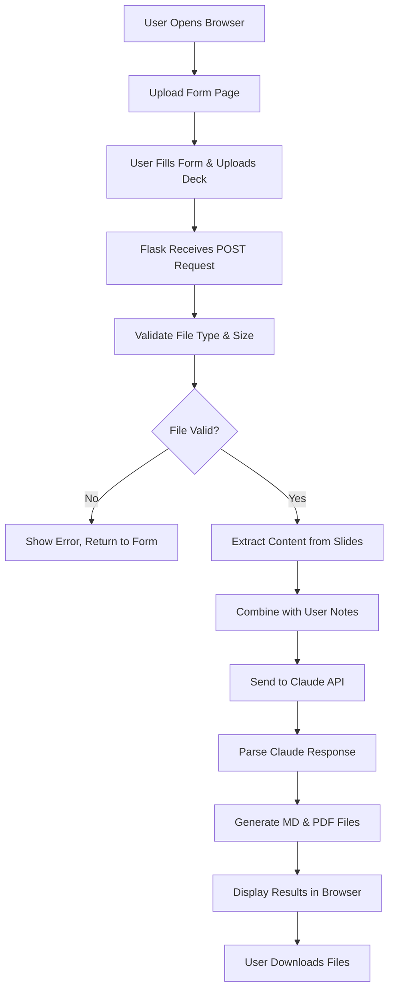

# Presentation Intelligence Tool - MVP Specification

## Project Overview

### Goal
Build a Flask-based web application that analyzes conference and vendor presentations using Claude AI to extract actionable insights for pre-sales engineers. The tool helps identify opportunities to add value for clients and build trust through relevant knowledge sharing.

### Key Value Proposition
Transform technical presentations into strategic pre-sales intelligence by identifying customer pain points, trust-building opportunities, and actionable conversation starters.

---

## Technical Requirements

### Technology Stack
- **Language**: Python 3.9+
- **Web Framework**: Flask 3.0+
- **AI Engine**: Claude Sonnet 4.5 (Anthropic API)
- **Document Processing**:
  - PyMuPDF (fitz) - PDF text/image extraction
  - python-pptx - PowerPoint parsing
  - Pillow - Image handling
- **Output Generation**:
  - markdown2 - Markdown rendering
  - WeasyPrint - PDF generation from HTML
- **Configuration**: python-dotenv for environment variables

### Core Dependencies (requirements.txt)
```
Flask==3.0.0
anthropic==0.25.0
PyMuPDF==1.23.0
python-pptx==0.6.23
Pillow==10.0.0
markdown2==2.4.10
weasyprint==60.0
python-dotenv==1.0.0
Werkzeug==3.0.0
```

---

## System Architecture

### Application Flow


### Directory Structure
```
presentation-intel/
├── app.py                      # Main Flask application & routes
├── requirements.txt            # Python dependencies
├── .env                       # Environment variables (gitignored)
├── .env.example               # Template for environment setup
├── README.md                  # Setup and usage instructions
├── utils/
│   ├── __init__.py
│   ├── document_parser.py     # Extract text/images from PDF/PPTX
│   ├── claude_analyzer.py     # Claude API interaction & prompting
│   └── output_generator.py    # Generate downloadable MD/PDF files
├── templates/
│   ├── index.html            # Upload form page
│   └── results.html          # Analysis results display
├── static/
│   ├── css/
│   │   └── style.css         # Basic styling
│   └── js/
│       └── app.js            # Optional: form validation, UX enhancements
└── outputs/                  # Temporary storage for generated files
    └── .gitkeep
```

---

## Feature Specifications

### Input Requirements

#### User Form Fields
1. **Presentation Title** (required)
   - Text input field
   - Max length: 200 characters

2. **Presenter Names** (required)
   - Text input field
   - Max length: 300 characters
   - Format: Comma-separated or free text

3. **GitHub Repository URL** (optional)
   - Text input field
   - Max length: 500 characters
   - Placeholder: "https://github.com/username/repo"
   - Validation: Must be valid GitHub URL format if provided
   - Purpose: Link to lab guides, code samples, or related materials

4. **Your Notes** (required)
   - Textarea field
   - Max length: 2000 characters
   - Placeholder: "What did you find interesting? Key takeaways?"

5. **Slide Deck Upload** (required)
   - File input (accept: .pdf, .pptx)
   - Max file size: 50MB
   - Single file only (MVP)

#### File Handling
- **Supported Formats**: PDF, PPTX
- **Validation**:
  - Check file extension
  - Verify file size < 50MB
  - Validate file is readable
- **Storage**: Temporary (delete after processing or after 1 hour)

### Output Requirements

#### Analysis Components
The Claude-generated analysis must include:

1. **Executive Summary**
   - 3-5 concise sentences
   - High-level overview of presentation value

2. **Key Technical Insights**
   - 5-8 bullet points
   - Technical concepts, technologies, or methodologies discussed

3. **Client Value Connections**
   - How this knowledge helps your customers
   - Trust-building conversation starters (3-5 specific examples)
   - Problem-solving applications

4. **Pre-Sales Opportunities**
   - Where this fits in customer tracking/relationship building
   - Actionable follow-up strategies
   - Customer segment recommendations

5. **Intelligent Follow-Up Questions**
   - 5-7 questions to deepen understanding
   - Questions that lead to sales opportunities

#### Output Formats

**1. Web Display (results.html)**
- Clean, readable HTML layout
- Sections clearly separated
- Basic styling (no need for fancy design in MVP)
- Download buttons for MD and PDF

**2. Markdown File**
- Structured with headers (H1, H2, H3)
- Bullet points for lists
- Metadata section (title, presenters, date analyzed)
- Footer with tool attribution

**3. PDF File**
- Generated from Markdown or HTML
- Professional formatting
- Page breaks between major sections
- Header/footer with presentation title and page numbers

---

## Implementation Details

### 1. Document Parser (utils/document_parser.py)

**Purpose**: Extract text and optionally images from PDF and PPTX files

**Key Functions**:

```python
def extract_from_pdf(file_path: str) -> dict:
    """
    Extract text from PDF slides.
    
    Returns:
        {
            'text': str,  # All extracted text
            'pages': int,  # Number of pages
            'has_images': bool  # Whether images were detected (optional for MVP)
        }
    """
    pass

def extract_from_pptx(file_path: str) -> dict:
    """
    Extract text from PowerPoint slides.
    
    Returns:
        {
            'text': str,  # All extracted text from slides
            'slides': int,  # Number of slides
            'notes': str  # Speaker notes if available
        }
    """
    pass

def extract_content(file_path: str, file_type: str) -> dict:
    """
    Main entry point - routes to appropriate extractor.
    
    Args:
        file_path: Path to uploaded file
        file_type: 'pdf' or 'pptx'
    
    Returns:
        Extracted content dictionary
    """
    pass
```

**Implementation Notes**:
- For MVP: Focus on text extraction only
- Images: Detect presence but don't send to Claude (future enhancement)
- Error handling: Return empty string if extraction fails, log error

### 2. Claude Analyzer (utils/claude_analyzer.py)

**Purpose**: Interact with Claude API and manage prompt engineering

**Key Functions**:

```python
def build_analysis_prompt(title: str, presenters: str, user_notes: str, 
                         slide_content: str, github_url: str = None) -> str:
    """
    Construct the prompt for Claude with all context.
    
    Args:
        title: Presentation title
        presenters: Presenter names
        user_notes: User's personal notes
        slide_content: Extracted text from slides
        github_url: Optional GitHub repository URL
    
    Returns:
        Formatted prompt string
    """
    pass

def analyze_presentation(title: str, presenters: str, user_notes: str, 
                        slide_content: str, github_url: str = None) -> dict:
    """
    Send content to Claude API and parse response.
    
    Args:
        title: Presentation title
        presenters: Presenter names
        user_notes: User's personal notes
        slide_content: Extracted text from slides
        github_url: Optional GitHub repository URL
    
    Returns:
        {
            'executive_summary': str,
            'technical_insights': list[str],
            'github_value': str,  # Analysis of GitHub resources (if provided)
            'client_value': str,
            'presales_opportunities': str,
            'followup_questions': list[str],
            'raw_response': str  # Full Claude response
        }
    """
    pass
```

**Claude Prompt Template**:
```
You are a pre-sales engineering advisor analyzing a technical presentation.

PRESENTATION CONTEXT:
- Title: {title}
- Presenters: {presenters}
- Attendee's Personal Notes: {user_notes}
- GitHub Repository: {github_url} (contains lab guides, code samples, and related materials)

SLIDE CONTENT EXTRACTED:
{slide_content}

YOUR TASK:
Analyze this presentation and provide insights that help a pre-sales engineer leverage this knowledge to better serve their clients and build trust.

Please structure your response in the following sections:

## EXECUTIVE SUMMARY
Provide a 3-5 sentence overview of the presentation's key value and relevance.

## KEY TECHNICAL INSIGHTS
List 5-8 important technical concepts, technologies, or methodologies discussed:
- [Insight 1]
- [Insight 2]
...

## GITHUB REPOSITORY VALUE
If a GitHub repository was provided, analyze how the lab guides and code samples enhance the presentation:
- What practical value do the labs/code provide?
- How can these resources be used in customer demos or POCs?
- What technical credibility does this add to the presentation?

## CLIENT VALUE CONNECTIONS

### How This Knowledge Helps Your Customers
Explain 2-3 specific ways this information can solve customer problems or address their needs.

### Trust-Building Conversation Starters
Provide 3-5 specific conversation starters you can use with clients to demonstrate expertise:
- [Starter 1]
- [Starter 2]
...

### Problem-Solving Applications
Describe 2-3 scenarios where you can apply this knowledge to customer situations.

### Hands-On Resources for Customers
If GitHub repo is provided, suggest 2-3 ways to leverage the lab guides or code samples with customers:
- Demo opportunities
- POC accelerators
- Customer self-service resources

## PRE-SALES OPPORTUNITIES

### Customer Tracking & Relationship Building
Explain how this knowledge fits into ongoing customer relationship development.

### Actionable Follow-Up Strategies
Provide 3-4 specific actions to take based on this presentation:
- [ ] [Action 1]
- [ ] [Action 2]
...

### Relevant Customer Segments
Identify which types of customers or industries would most benefit from this knowledge.

## INTELLIGENT FOLLOW-UP QUESTIONS
List 5-7 questions that will help you deepen your understanding and identify sales opportunities:
1. [Question 1]
2. [Question 2]
...

Keep your response practical, actionable, and focused on pre-sales value.
```

**API Configuration**:
- Model: `claude-sonnet-4-20250514`
- Max tokens: 4096 (adjust based on testing)
- Temperature: 0.7 (balance creativity and consistency)

### 3. Output Generator (utils/output_generator.py)

**Purpose**: Create downloadable Markdown and PDF files

**Key Functions**:

```python
def generate_markdown(analysis: dict, metadata: dict) -> str:
    """
    Create formatted Markdown content.
    
    Args:
        analysis: Parsed Claude response
        metadata: {title, presenters, date, time}
    
    Returns:
        Formatted Markdown string
    """
    pass

def save_markdown_file(content: str, output_dir: str, filename: str) -> str:
    """
    Save Markdown to file.
    
    Returns:
        File path
    """
    pass

def generate_pdf(markdown_content: str, output_dir: str, filename: str) -> str:
    """
    Convert Markdown to PDF using WeasyPrint.
    
    Returns:
        PDF file path
    """
    pass
```

**Markdown Template Structure**:
```markdown
# Presentation Analysis: {title}

**Presenters:** {presenters}  
**Analyzed:** {date} at {time}  
**GitHub Repository:** {github_url if provided}  
**Analyzed by:** Presentation Intelligence Tool

---

## Executive Summary

{executive_summary}

---

## Key Technical Insights

{technical_insights as bullets}

---

## GitHub Repository Resources

{github_value_analysis}

**Repository Link:** [{github_url}]({github_url})

### Practical Applications
- Demo opportunities with lab guides
- POC accelerators using code samples
- Customer self-service learning resources

---

## How This Helps Your Clients

### Trust-Building Opportunities

{trust_building_items}

### Problem-Solving Applications

{problem_solving_items}

### Hands-On Customer Engagement

{github_customer_applications}

---

## Pre-Sales Action Items

{presales_opportunities as checkboxes}

---

## Customer Segment Recommendations

{customer_segments}

---

## Intelligent Follow-Up Questions

{followup_questions as numbered list}

---

*Generated by Presentation Intelligence Tool*  
*Powered by Claude AI (Anthropic)*
```

### 4. Flask Application (app.py)

**Routes**:

```python
@app.route('/', methods=['GET'])
def index():
    """
    Display upload form.
    """
    pass

@app.route('/analyze', methods=['POST'])
def analyze():
    """
    Process uploaded presentation:
    1. Validate form inputs
    2. Save uploaded file temporarily
    3. Extract content from file
    4. Send to Claude for analysis
    5. Generate output files
    6. Render results page with download links
    """
    pass

@app.route('/download/<file_type>/<filename>')
def download(file_type, filename):
    """
    Serve generated files for download.
    
    Args:
        file_type: 'md' or 'pdf'
        filename: Generated filename
    """
    pass

@app.route('/health')
def health():
    """
    Health check endpoint.
    """
    pass
```

**Configuration**:
```python
app.config['MAX_CONTENT_LENGTH'] = 50 * 1024 * 1024  # 50MB
app.config['UPLOAD_FOLDER'] = 'uploads'
app.config['OUTPUT_FOLDER'] = 'outputs'
app.config['SECRET_KEY'] = os.getenv('FLASK_SECRET_KEY')
```

**Error Handling**:
- File too large: Flash message, redirect to form
- Invalid file type: Flash message, redirect to form
- Claude API error: Display friendly error page with retry option
- Missing API key: Clear error message with setup instructions

---

## User Interface Design

### Upload Form (templates/index.html)

**Layout**:
- Clean, centered form
- Clear labels and placeholders
- File upload with drag-and-drop (optional enhancement)
- Submit button
- Basic validation (required fields)

**HTML Structure**:
```html
<form method="POST" action="/analyze" enctype="multipart/form-data">
    <label>Presentation Title*</label>
    <input type="text" name="title" required maxlength="200">
    
    <label>Presenter Names*</label>
    <input type="text" name="presenters" required maxlength="300">
    
    <label>GitHub Repository URL (Optional)</label>
    <input type="url" name="github_url" maxlength="500" 
           placeholder="https://github.com/username/repo"
           pattern="https://github\.com/.*">
    <small>Link to lab guides, code samples, or related materials</small>
    
    <label>Your Notes*</label>
    <textarea name="notes" required maxlength="2000" 
              placeholder="What did you find interesting?"></textarea>
    
    <label>Upload Slide Deck* (PDF or PPTX, max 50MB)</label>
    <input type="file" name="deck" accept=".pdf,.pptx" required>
    
    <button type="submit">Analyze Presentation</button>
</form>
```

### Results Page (templates/results.html)

**Layout**:
- Display analysis sections with clear headers
- Download buttons at top and bottom
- "Analyze Another" button to return to form
- Basic responsive design

**Sections to Display**:
1. Metadata (title, presenters, date)
2. Executive Summary
3. Key Insights
4. Client Value
5. Pre-Sales Opportunities
6. Follow-up Questions

**Download Buttons**:
```html
<div class="download-buttons">
    <a href="/download/md/{{ filename }}" class="btn">Download Markdown</a>
    <a href="/download/pdf/{{ filename }}" class="btn">Download PDF</a>
</div>
```

---

## Configuration & Environment

### Environment Variables (.env)
```
# Anthropic API
ANTHROPIC_API_KEY=sk-ant-xxxxxxxxxxxxx

# Flask Configuration
FLASK_SECRET_KEY=your-random-secret-key-here
FLASK_ENV=development
FLASK_DEBUG=True

# Application Settings
MAX_FILE_SIZE_MB=50
CLEANUP_INTERVAL_HOURS=1
```

### .env.example Template
```
# Anthropic API Key (required)
# Get your key at: https://console.anthropic.com/
ANTHROPIC_API_KEY=your-api-key-here

# Flask Secret Key (required)
# Generate with: python -c "import secrets; print(secrets.token_hex(32))"
FLASK_SECRET_KEY=generate-a-random-secret-key

# Flask Environment
FLASK_ENV=development
FLASK_DEBUG=True

# Application Settings
MAX_FILE_SIZE_MB=50
CLEANUP_INTERVAL_HOURS=1
```

---

## Setup & Deployment Instructions

### Local Development Setup

1. **Clone/Create Project**:
```bash
mkdir presentation-intel
cd presentation-intel
```

2. **Create Virtual Environment**:
```bash
python3 -m venv venv
source venv/bin/activate  # On Windows: venv\Scripts\activate
```

3. **Install Dependencies**:
```bash
pip install -r requirements.txt
```

4. **Configure Environment**:
```bash
cp .env.example .env
# Edit .env with your ANTHROPIC_API_KEY
```

5. **Create Required Directories**:
```bash
mkdir -p uploads outputs static/css templates utils
```

6. **Run Application**:
```bash
python app.py
```

7. **Access Application**:
```
http://localhost:5000
```

### Testing Checklist

- [ ] Upload PDF file successfully
- [ ] Upload PPTX file successfully
- [ ] Form validation works (required fields)
- [ ] GitHub URL validation (optional field, but must be valid URL if provided)
- [ ] File size limit enforced (50MB)
- [ ] Invalid file types rejected
- [ ] Claude API returns analysis
- [ ] Claude analysis includes GitHub repository insights (when URL provided)
- [ ] Markdown file generates correctly
- [ ] PDF file generates correctly
- [ ] Download buttons work
- [ ] Error messages display properly

---

## Security Considerations

### For MVP
1. **API Key Protection**:
   - Store in .env file
   - Never commit to version control
   - Add .env to .gitignore

2. **File Upload Security**:
   - Validate file extensions
   - Limit file size
   - Use secure temporary storage
   - Delete files after processing

3. **Flask Security**:
   - Use secure secret key
   - Enable CSRF protection (Flask-WTF for forms)
   - Sanitize user inputs

### Not for MVP (Future Enhancements)
- User authentication
- Rate limiting
- HTTPS enforcement
- Database encryption

---

## Error Handling Strategy

### User-Facing Errors
1. **File Upload Issues**:
   - "File is too large (max 50MB)"
   - "Invalid file type (only PDF and PPTX supported)"
   - "Could not read file - it may be corrupted"

2. **API Errors**:
   - "Analysis service temporarily unavailable - please try again"
   - "API key not configured - contact administrator"

3. **Processing Errors**:
   - "Could not extract content from presentation"
   - "Analysis generation failed - please try again"

### Logging Strategy
- Log all errors to console (development)
- Include timestamps, error types, and context
- Do not log sensitive information (API keys, user data)

**Example Log Format**:
```
[2024-01-15 14:30:22] ERROR: Failed to extract PDF content
File: presentation.pdf, Size: 15MB, Error: Invalid PDF structure
```

---

## Future Enhancements (Post-MVP)

### Phase 2: Data Persistence
- Save analysis history to SQLite database
- Search past analyses
- Tag and categorize presentations
- Export multiple analyses to single report

### Phase 3: Advanced Features
- Batch processing (multiple presentations)
- Image analysis from slides (send to Claude Vision)
- Presentation comparison tool
- Trend analysis across multiple events

### Phase 4: Collaboration
- User authentication
- Share analyses with team members
- Comment and annotation features
- Team knowledge base

### Phase 5: Integration
- CRM integration (Salesforce, HubSpot)
- Calendar integration (auto-import conference sessions)
- Email integration (send summaries to team)
- Slack/Teams notifications

### Phase 6: Intelligence
- Customer matching (suggest which clients benefit from insights)
- Automatic follow-up reminders
- Competitive intelligence tracking
- Industry trend identification

---

## Success Criteria for MVP

### Functional Requirements Met
- ✅ User can upload PDF or PPTX file
- ✅ User can input presentation metadata and notes
- ✅ System extracts text from slides
- ✅ Claude generates comprehensive analysis
- ✅ User can view analysis in browser
- ✅ User can download Markdown file
- ✅ User can download PDF file

### Non-Functional Requirements
- ✅ Analysis completes within 60 seconds (typical)
- ✅ Supports files up to 50MB
- ✅ Clear error messages for all failure scenarios
- ✅ Simple, intuitive user interface
- ✅ Works on modern browsers (Chrome, Firefox, Safari, Edge)

### Quality Criteria
- ✅ Code is readable and documented
- ✅ Project structure is logical
- ✅ README with setup instructions included
- ✅ Dependencies clearly listed
- ✅ Environment variables documented

---

## Development Notes for AI Agent

### Implementation Priority Order
1. **Phase 1**: Set up Flask app structure, basic routing, and templates
2. **Phase 2**: Implement document parser (PDF and PPTX extraction)
3. **Phase 3**: Implement Claude API integration with prompt engineering
4. **Phase 4**: Implement output generators (Markdown and PDF)
5. **Phase 5**: Connect all components in Flask routes
6. **Phase 6**: Add error handling and validation
7. **Phase 7**: Polish UI and add styling
8. **Phase 8**: Testing and bug fixes

### Code Style Guidelines
- Use type hints for function parameters and returns
- Include docstrings for all functions
- Follow PEP 8 style guide
- Keep functions focused and single-purpose
- Handle errors gracefully with try-except blocks

### Testing Recommendations
- Test with various PDF formats
- Test with various PPTX formats
- Test with oversized files
- Test with empty/minimal presentations
- Test with presentations containing special characters
- Test Claude API error scenarios (rate limit, invalid key, etc.)

### Key Decision Points
1. **Image Handling**: For MVP, skip sending images to Claude. Just extract text. This simplifies implementation significantly.
2. **Storage**: Use temporary file storage with periodic cleanup. Don't persist analyses in MVP.
3. **Styling**: Keep CSS minimal and functional. Focus on usability over aesthetics for MVP.
4. **Error Recovery**: On errors, always return user to form with their inputs preserved (if possible).

---

## Questions & Assumptions

### Assumptions Made
- User has valid Anthropic API key with Claude access
- Single user deployment (no authentication needed for MVP)
- User will manually manage old files in outputs folder
- Text-only analysis is sufficient (no image analysis yet)
- Desktop browser is primary use case (mobile is secondary)

### Open Questions (Clarify if Needed)
1. Should the tool save a history of analyses, or is it truly "one-shot"?
2. Is there a preferred PDF generation method (WeasyPrint, ReportLab, or other)?
3. Should there be any usage analytics (e.g., count of analyses performed)?
4. Is there a need for a "sample presentation" for testing/demo purposes?

---

## Appendix: Sample Outputs

### Sample Markdown Output
```markdown
# Presentation Analysis: The Future of Network Automation

**Presenters:** Jane Smith, John Doe  
**Analyzed:** January 15, 2024 at 2:30 PM  
**GitHub Repository:** https://github.com/network-automation/future-labs  
**Analyzed by:** Presentation Intelligence Tool

---

## Executive Summary

This presentation explores emerging trends in network automation, focusing on intent-based networking and AI-driven operations. The speakers emphasized the shift from script-based automation to declarative models and the importance of observability in modern networks. Key takeaways include the role of digital twins in network testing and the growing adoption of GitOps practices for network configuration management.

---

## Key Technical Insights

- Intent-based networking (IBN) reduces configuration complexity by 60-70%
- Digital twins enable pre-deployment testing and what-if analysis
- AI/ML models can predict network failures 24-48 hours in advance
- GitOps brings version control and CI/CD practices to network operations
- Observability platforms reduce mean time to resolution (MTTR) by 40%
- Network-as-Code treats infrastructure as software artifacts
- Zero-touch provisioning is becoming standard for branch deployments

---

## GitHub Repository Resources

The accompanying GitHub repository provides hands-on lab guides and production-ready code samples that demonstrate the concepts discussed in the presentation. The repository includes:

- **Lab Guides**: Step-by-step tutorials for implementing intent-based networking with practical examples
- **Code Samples**: Python scripts and Ansible playbooks for network automation workflows
- **Digital Twin Examples**: Containerized network simulation environments for testing
- **GitOps Templates**: CI/CD pipeline configurations for network infrastructure

**Repository Link:** [https://github.com/network-automation/future-labs](https://github.com/network-automation/future-labs)

### Practical Applications
- **Customer Demos**: Use the lab guides to demonstrate automation concepts in 30-minute proof-of-concept sessions
- **POC Accelerators**: Leverage the code samples to quickly build customer-specific pilots without starting from scratch
- **Customer Self-Service**: Share repository with technical teams for self-paced learning and exploration
- **Technical Credibility**: Reference real, working code when discussing implementation approaches with customers

---

## How This Helps Your Clients

### Trust-Building Opportunities

- "I recently learned about how digital twin technology is being used to test network changes before deployment - would that be valuable for your upcoming data center migration?"
- "There's a growing trend toward intent-based networking that's showing 60-70% reduction in configuration errors. Let's discuss how this might apply to your multi-site deployment."
- "I attended a session on AI-driven network operations that can predict failures 24-48 hours in advance. Given your concerns about network uptime, this might be worth exploring."
- "The presenters shared some excellent lab guides and working code samples - I'd be happy to walk through a quick demo with your team."

### Problem-Solving Applications

- **For clients with frequent change management issues**: Introduce GitOps practices and automated testing workflows to reduce human error and speed up deployments.
- **For clients concerned about network reliability**: Position AI/ML-based predictive analytics as a proactive approach to avoiding outages.
- **For clients struggling with complex multi-vendor environments**: Recommend intent-based networking platforms that abstract vendor-specific details.

### Hands-On Customer Engagement

- **Interactive Workshops**: Use the lab guides to run hands-on sessions where customer teams can experience automation benefits firsthand
- **Customized POCs**: Fork the repository and adapt code samples to customer's specific environment for rapid proof-of-concept delivery
- **Knowledge Transfer**: Provide customers with access to the repository for ongoing learning and skill development
- **Reference Architecture**: Use the code samples as a foundation for designing customer-specific automation architectures

---

## Pre-Sales Opportunities

### Customer Tracking & Relationship Building

This knowledge positions you as an advisor on network modernization strategies. Use these insights during discovery calls to demonstrate awareness of industry trends and help customers envision their transformation journey. This is particularly valuable for customers in the "exploration" phase of network automation adoption.

### Actionable Follow-Up Strategies

- [ ] Schedule follow-up calls with customers planning network upgrades to discuss IBN benefits
- [ ] Create a simple ROI model showing potential error reduction with GitOps adoption
- [ ] Share a one-pager on digital twin technology with customers concerned about change risk
- [ ] Connect customers interested in AI/ML to relevant case studies or pilots
- [ ] Offer hands-on workshop using the GitHub lab guides for 3-5 key prospects
- [ ] Customize code samples for top customer's environment and present as POC accelerator

### Relevant Customer Segments

- **Enterprise IT teams** modernizing legacy networks
- **Service providers** deploying large-scale network automation
- **Financial services** requiring high-reliability networks with minimal downtime
- **Healthcare organizations** managing distributed campus networks
- **Manufacturing** implementing Industry 4.0 network infrastructure

---

## Intelligent Follow-Up Questions

1. What are the typical barriers to adopting intent-based networking in enterprise environments, and how can we help customers overcome them?
2. Which vendors or open-source projects are leading in the digital twin space for network testing?
3. What are realistic expectations for ROI timeline when implementing GitOps for network operations?
4. How do AI-driven predictive analytics integrate with existing monitoring and alerting systems?
5. What skills gaps exist in customer teams when transitioning to Network-as-Code practices?
6. Are there specific compliance or security considerations when implementing zero-touch provisioning?
7. What are the most compelling customer success stories demonstrating value from these automation trends?
8. How can we leverage the GitHub lab guides to accelerate customer POCs and reduce time-to-value?

---

*Generated by Presentation Intelligence Tool*  
*Powered by Claude AI (Anthropic)*
```

---

## Contact & Support

For questions about this specification, contact the project owner or refer to:
- Anthropic Claude API Docs: https://docs.anthropic.com/
- Flask Documentation: https://flask.palletsprojects.com/
- Python-PPTX Docs: https://python-pptx.readthedocs.io/
- PyMuPDF Docs: https://pymupdf.readthedocs.io/

---

**END OF SPECIFICATION**

*Version: 1.0 - MVP*  
*Last Updated: [Current Date]*